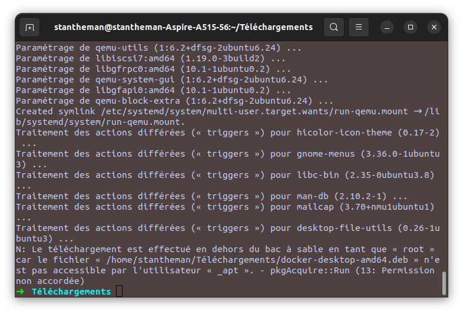
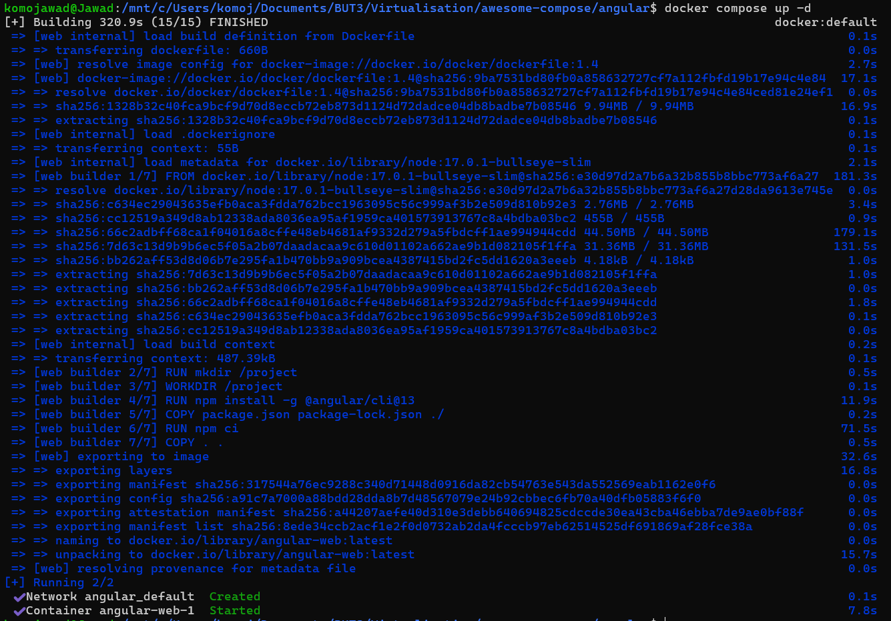
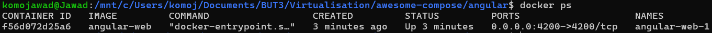
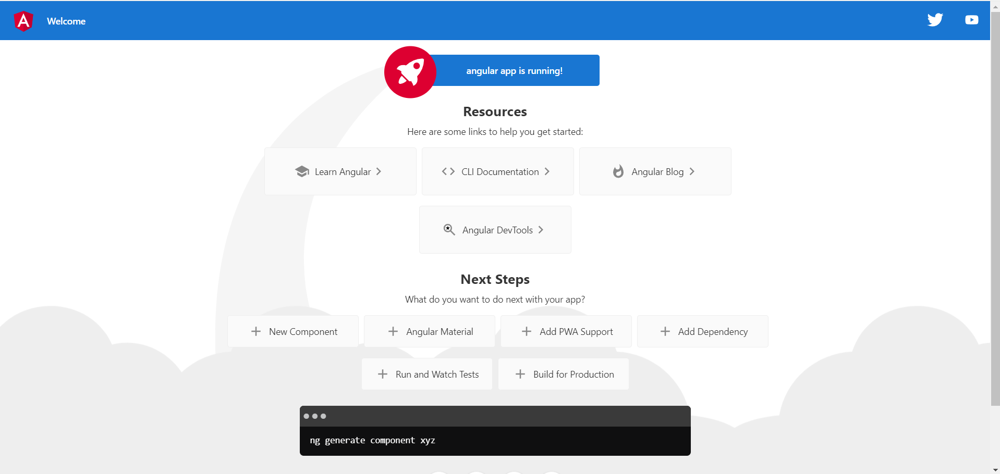

# TD_Virtualisation_Avancee

## TD 1

### Installation de docker desktop

Pour l'installation de docker, il a déjà fallu télécharger le [package debian](https://desktop.docker.com/linux/main/amd64/docker-desktop-amd64.deb?utm_source=docker&utm_medium=webreferral&utm_campaign=docs-driven-download-linux-amd64) puis l'installer avec apt-get en se plaçant à la racine de là où il a été téléchargé.
```bash
sudo apt-get install ./docker-desktop-amd64.deb
```

Le fait d'installer directement Docker Desktop permet à la machine de bénéficier par cette même installation de : 
- Docker CLI (L'interface en ligne de commande `docker`).
- Docker Engine (Le moteur de conteneurs).
- Docker Compose (pour les applications multi-conteneurs).



Pour vérifier que docker est bien installé, on peut vérifier : 
```bash
➜  ~ docker compose version
Docker Compose version v2.29.2-desktop.2
➜  ~ docker --version
Docker version 27.3.1, build ce12230
➜  ~ docker version
Client: Docker Engine - Community
 Version:           27.3.1
 API version:       1.47
 Go version:        go1.22.7
 Git commit:        ce12230
 Built:             Fri Sep 20 11:41:00 2024
 OS/Arch:           linux/amd64
 Context:           desktop-linux

Server: Docker Desktop 4.34.3 (170107)
 Engine:
  Version:          27.2.0
  API version:      1.47 (minimum version 1.24)
  Go version:       go1.21.13
  Git commit:       3ab5c7d
  Built:            Tue Aug 27 14:15:15 2024
  OS/Arch:          linux/amd64
  Experimental:     false
 containerd:
  Version:          1.7.20
  GitCommit:        8fc6bcff51318944179630522a095cc9dbf9f353
 runc:
  Version:          1.1.13
  GitCommit:        v1.1.13-0-g58aa920
 docker-init:
  Version:          0.19.0
  GitCommit:        de40ad0
➜  ~ 
```

On peut faire en sorte que le démon soit lancé après chaque démarrage, de sorte à ce qu'on puisse utiliser docker sans soucis sans même lancer l'application desktop.
```bash
➜  ~ systemctl --user enable docker-desktop
Created symlink /home/stantheman/.config/systemd/user/docker-desktop.service → /usr/lib/systemd/user/docker-desktop.service.
Created symlink /home/stantheman/.config/systemd/user/graphical-session.target.wants/docker-desktop.service → /usr/lib/systemd/user/docker-desktop.service.
```


### Exemple d'utilisation
Pour l'exemple, nous avons choisi le service [Angular](https://angular.dev/).
Le projet a la structure suivante :
```
.
├── angular
│   ├── Dockerfile
│   ├── ...
│   ├── ...
│   ....
└── compose.yaml
```

Le compose.yaml se décrit comme suit :
```yaml
services:
  web:
    build:
      context: angular
      target: builder
    ports:
      - 4200:4200
    volumes:
      - ./angular:/project
      - /project/node_modules
```
Ce fichier définit une application avec un service angular. L'image pour le service est construite grâce au [Dockerfile](Ressources/files/Dockerfile) qui se trouve dans le dossier ``angular``.
La section ``ports`` sert à établir une correspondance entre le port du conteneur (ici 4200) et le port de la machine hôte (également 4200). Bien sûr, si le port est déjà utilisé, il faut modifier la valeur.

La section ``volumes`` permet de monter des volumes dans le conteneur. Un volume est une méthode utilisée pour partager des données entre la machine hôte et le conteneur ou pour persister des données au-delà du cycle de vie du conteneur. 

La première ligne signifie que tout ce qui se trouve dans le dossier ``./angular`` de la machine hôte sera accessible dans le conteneur à l'emplacement ``/project``. Cela permet de développer en temps réel, toute modification faite dans ./angular sur l'hôte sera automatiquement reflétée dans le conteneur.

Pour la deuxième ligne, seul le chemin dans le conteneur est spécifié. C'est donc un "volume anonyme". Docker va créer un volume interne à cet emplacement dans le conteneur. Ainsi, on évite que les fichiers du dossier ``node_modules`` de l'application soient écrasés ou interférent avec ceux du système hôte. Les dépendances npm installées resteront isolées dans ce volume.

Et maintenant, on utilise ``docker compose up -d`` pour créer et démarrer le conteneur spécifié dans le fichier ``compose.yaml``. Le ``-d`` permet l'exécution en arrière-plan, sans cette option, les logs du conteneur s'afficheront directement dans le terminal.



On peut vérifier que le conteneur est bien en cours d'exécution avec ``docker ps``.



Maintenant que l'application est lancée, on peut y accéder depuis notre navigateur avec l'URL : ``http://localhost:4200``.



Tout fonctionne ! On peut désormais stopper et supprimer le conteneur avec ``docker compose down``.


