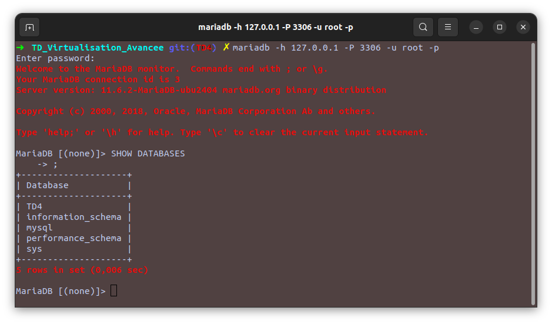
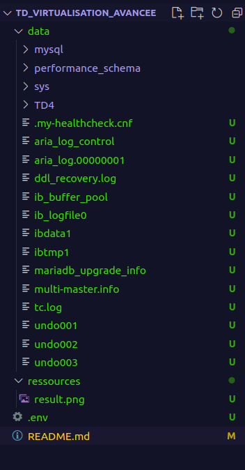

# TD Virtualisation Avancee

## TD 4 : Docker

> Note : L'utilisation d'un mot de passe pour l'utilisateur root a été faite en première étape n'ayant pas réussi à se connecter sans.

Pour ce TD, nous utiliserons la version CLI de MariaDB. L'installation est très simple :  
```bash
sudo apt install mariadb-client
```
On vérifie l'installation et la version :  
```bash
➜  ~ mariadb --version
mariadb  Ver 15.1 Distrib 10.6.18-MariaDB, for debian-linux-gnu (x86_64) using  EditLine wrapper
```

Afin de pouvoir lancer un container MariaDB sur notre machine, on doit d'abord récupérer son image sur [docker hub](https://hub.docker.com/_/mariadb).

```bash
➜  ~ docker pull mariadb
```

Ensuite, l'image est ajoutée dans notre librairie d'images, on peut le voir en listant nos images : 
```bash
➜  ~ docker images        
REPOSITORY            TAG       IMAGE ID       CREATED       SIZE
mariadb               latest    a9547599cd87   11 days ago   550MB
```


Afin de pouvoir accéder au service MariaDB lancé sur le container, il va nous falloir mapper le port du container à celui de notre machine. C'est à dire que docker crée son propre réseau pour ses containers, ils sont donc isolés du du notre (machine hôte). Par défaut, le port de mariadb est ``3306``, on va donc mapper le port 3306 du conteneur au port 3306 de notre machine.


Mais tout d'abord, on va créer un fichier **.env** qui comportera le mot de passe root de MariaDB.

```ini
MARIADB_ROOT_PASSWORD=PJB4&fn*uVl3hjKx
```

```bash
➜  ~ docker run -d --name mariadb-td4 --env-file .env -p 3306:3306 mariadb
```
- On spécifie ``-d`` pour que le conteneur tourne en arrière plan.
- ``--name`` pour définir le nom du conteneur.
- ``--env-file`` pour spécifier le fichier contenant les variables d'environnement. *Dans notre cas on définit le mot de passe root du service mariadb pour pouvoir s'y connecter depuis notre hôte.*
- `-p` pour indiquer : 
    - *A gauche* : Le port de la machine hôte depuis lequel on peut accéder au service.
    - *A droite* : Le port du conteneur depuis lequel le service est accessible.
    - Cette option permet donc de mapper un port de la machine hôte à un port du conteneur pour pouvoir accéder au service conteneurisé.
- ``mariadb`` : le nom de l'image dont on conteneurise une instance.

Maintenant, pour accéder au service depuis notre machine hôte, on sait qu'on peut utiliser le port 3306.

On utilise donc le client ``mariadb``  pour accéder à ce service, en se rappelant du mot de passe qu'on a créé dans le fichier d'environnement précédemment.
```bash
mariadb -h 127.0.0.1 -P 3306 -u root -p
```

On est bien connecté au service, maintenant on peut créer notre base de données puis notre table.
```sql
MariaDB [(none)]> CREATE DATABASE TD4;
Query OK, 1 row affected (0,002 sec)

MariaDB [(none)]> USE TD4;
Database changed


MariaDB [TD4]> create table projects(
    -> project_id int auto_increment,
    -> project_name varchar(255) not null,
    -> begin_date date,
    -> end_date date,
    -> cost decimal(15,2) not null,
    -> created_at timestamp default current_timestamp,
    -> primary key(project_id)
    -> );
Query OK, 0 rows affected (0,025 sec)
```


##### Question 4)
Maintenant, on liste les contenurs : 
```bash
➜  ~ docker ps
CONTAINER ID   IMAGE     COMMAND                  CREATED          STATUS          PORTS                    NAMES
f5ef08af9e5a   mariadb   "docker-entrypoint.s…"   10 minutes ago   Up 10 minutes   0.0.0.0:3306->3306/tcp   mariadb-td4
```

Puis on stop et on arrête le conteneur : 
```bash
➜  ~ docker stop mariadb-td4
mariadb-td4

➜  ~ docker rm mariadb-td4
mariadb-td4
```

Ensuite, si on refait les manipulations précédentes pour relancer le service et s'y connecter avec le client mariadb, notre table n'existe plus, ainsi que la base de données qu'on avait créée : 
```
MariaDB [(none)]> USE TD4
ERROR 1049 (42000): Unknown database 'TD4'
```


Pour pouvoir conserver notre table ainsi que notre base de données même après plusieurs suppression de conteneur, il faut mapper un volume.

> Un volume dans Docker est un mécanisme de stockage persistant qui permet de sauvegarder des données en dehors du cycle de vie d'un conteneur. Contrairement au système de fichiers interne d'un conteneur, les volumes ne sont pas supprimés lorsque le conteneur est arrêté ou supprimé.

Pour ce faire, on crée déjà un dossier en local ``data`` : 
```bash
➜  TD_Virtualisation_Avancee git:(TD4) ✗ mkdir data
```
C'est ce dossier que l'on va monter. Ensuite, il suffit d'utiliser l'option ``-v`` pour indiquer le dossier qu'on décide de monter, et l'endroit où il doit être monté dans le conteneur.

```bash
docker run -d -v ./data:/var/lib/mysql --name mariadb-td4 --env-file .env -p 3306:3306 mariadb
```

En reproduisant les étapes précédentes, en créant la base de données ainsi que la table, on remarque qu'après plusieurs suppressions et lancements d'un conteneur mariadb, les informations ne disparaissent pas.



C'est justement parce que le dossier ``data/`` est partagé (grâce au mapping) entre notre machine hôte et les conteneurs qu'on instancie.  



