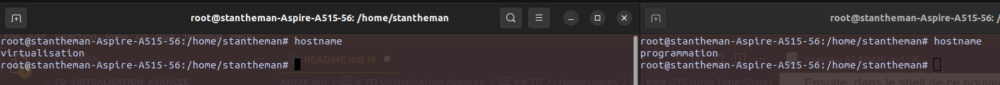

# TD Virtualisation Avancee

## TD 2 : Namespaces

Les namespaces sont très utiles pour isoler des **ressources** dans un "conteneur" (en réalité, un conteneur est un ensemble de namespaces). Ces **ressources** peuvent être, par exemple : 
- Des utilisateurs.
- Des réseaux.
- Des processus. 
- Des disques.

> <u>Exemple</u> : *Par défaut, tous les processus du système voient le même hostname. Par exemple, si un processus modifie l'hostname, ce dernier sera modifié pour tous les processus. Pour ce cas, il faut créer un **namespace** de type **UTS** (Unix Time Sharing) pour mettre des processus à l'intérieur, et modifier l'hostname uniquement pour ceux-ci*.

On peut donc définir un namespace par un ensemble de processus ayant une **vision commune** d'une ressource partagée.


### Mount
Avec unshare, Mount permet à chaque processus d'avoir son propre système de fichiers (pour gérer les points de montage, disques, etc.). 

Pour bien comprendre ce que ça fait, il faut savoir que **mount** attache un système de fichiers à l'arborescence du système. C'est le mécanisme qui permet à l'OS de voir et accéder à des fichiers, des disques ou des partitions.
Si on mount un dossier avec unshare, le/les processus d'unshare vont pouvoir accéder au **montage de ce dossier**, mais pas les processus en dehors. Le dossier et ses fichiers eux, restent visibles par tous les processus.

On crée deux namespaces **mount**.

```bash
➜  ~ sudo unshare --mount --fork bash
```

```bash
➜  ~ sudo unshare --mount --fork bash
```

Dans le premier namespace qu'on a créé, on crée d'abord un dossier et un fichier à l'intérieur. 
```bash
root@stantheman-Aspire-A515-56:/home/stantheman# mkdir /tmp/mount_test
root@stantheman-Aspire-A515-56:/home/stantheman# echo "coucou" > /tmp/mount_test/hey.txt
```

Ce dossier (ainsi que son contenu) est visible à la fois par les deux namespaces, et par la machine hôte.
```bash
➜  ~ ls -l /tmp/mount_test
total 4
-rw-r--r-- 1 root root 7 nov.  19 19:21 hey.txt
```

```bash
// shell de l'autre namespace sur lequel on a encore rien fait
root@stantheman-Aspire-A515-56:/home/stantheman# ls -l /tmp/mount_test/
total 4
-rw-r--r-- 1 root root 7 nov.  19 19:21 hey.txt
```
> Comme on doit lancer les namespaces en super utilisateur, le créateur et propriétaire est *root*.

<br>

Maintenant, dans le premier namespace, on monte le dossier `/home` dans `/tmp/mount_test`. Cela redirige (référence partagée, pas une copie) tout le contenu de `/home` vers `/tmp/mount_test`, mais uniquement pour ce namespace :
```bash
root@stantheman-Aspire-A515-56:/home/stantheman# mount --bind /home /tmp/mount_test

root@stantheman-Aspire-A515-56:/home/stantheman# mount | grep /tmp/mount_test
/dev/nvme0n1p2 on /tmp/mount_test type ext4 (rw,relatime,errors=remount-ro)
```
On peut donc voir que le contenu de `/home` (`stantheman/`) est bien monté dans `/tmp/mount_test` pour le premier namespace, mais pas pour les autres.
> La commande mount a écrasé le contenu de `/tmp/mount_test`, c'est pour cela que hey.txt a disparu.

En revanche, si on regarde depuis l'autre namespace ou la machine hôte, on ne voit pas le **mount** ni le contenu qui a été mount (le `/home`). Ce qui prouve qu'il est bien isolé :
```bash
root@stantheman-Aspire-A515-56:/home/stantheman# ls -l /tmp/mount_test/
total 4
-rw-r--r-- 1 root root 7 nov.  19 19:21 hey.txt
```

```bash
➜  ~ mount | grep /tmp/mount_test
➜  ~ ls -l /tmp/mount_test 
total 4
-rw-r--r-- 1 root root 7 nov.  19 19:21 hey.txt
```

Maintenant, si on modifie le /home, ce sera directement répercuté dans le point de montage `/tmp/mount_test` du namespace à l'origine du montage : 

```bash
➜  /home sudo mkdir preuve_montage
[sudo] Mot de passe de stantheman : 
➜  /home ls
preuve_montage  stantheman
```

Shell du premier namespace : 
```bash
root@stantheman-Aspire-A515-56:/home/stantheman# ls /tmp/mount_test/
preuve_montage  stantheman
```

Shell du deuxieme namespace :
```bash
root@stantheman-Aspire-A515-56:/home/stantheman# ls /tmp/mount_test/
hey.txt
```


### UTS (Unix Time Share)
Pour créer un premier namespace UTS, on utilise la commande 
```bash
➜  ~ sudo unshare --uts --fork bash
// On est donc dans le nouveau namespace qu'on vient de créer, avec un shell
root@stantheman-Aspire-A515-56:/home/stantheman#
```

Ensuite, dans le shell de ce nouveau namespace, on modifie le *hostname*.
```bash
root@stantheman-Aspire-A515-56:/home/stantheman# hostname virtualisation
```

On crée maintenant un deuxième namespace UTS en modifiant aussi l'hostname : 
```bash
➜  ~ sudo unshare --uts --fork bash
root@stantheman-Aspire-A515-56:/home/stantheman# hostname programmation
```
On a donc créé deux namespaces différents, isolés l'un de l'autre. On peut maintenant vérifier que les *hostname* sont différents. 



On peut aussi vérifier que l'hostname de la machine hôte n'a été modifié par aucun de ces deux namespaces.

```bash
➜  ~ hostname
stantheman-Aspire-A515-56
```

### IPC (Inter-Process Communication)
IPC correspond à la communication inter-processus. Le but de créer des namespaces permet d'isoler les communications entre les différents processus. Cela veut dire que chaque processus peut avoir son propre espace de communication (mémoire partagée, sémaphores, etc.).

Comme pour chaque type d'isolation, on crée deux namespaces IPC : 
```bash
sudo unshare --ipc --fork bash
```
```bash
sudo unshare --ipc --fork bash
```

Pour cet exemple, on va utiliser les **segments de mémoire partagée** qui permet à plusieurs processus d'accéder à une zone mémoire commune. On va donc vérifier que si on crée un segment mémoire dans le premier namespace, il soit invisible pour le deuxième.

Dans le premier namespace, on crée plusieurs segments de mémoire partagée : 
```bash
root@stantheman-Aspire-A515-56:/home/stantheman# ipcmk -M 128
identifiant de mémoire partagée : 0
root@stantheman-Aspire-A515-56:/home/stantheman# ipcmk -M 128
identifiant de mémoire partagée : 1
root@stantheman-Aspire-A515-56:/home/stantheman# ipcmk -M 128
identifiant de mémoire partagée : 2
```
On peut différencier ces segments avec leur identifiant. On peut les lister avec : 
```bash
root@stantheman-Aspire-A515-56:/home/stantheman# ipcs -m

------ Segment de mémoire partagée --------
clef       shmid      propriétaire perms      octets     nattch     états      
0x80dca399 0          root       644        128        0                       
0xa32b5316 1          root       644        128        0                       
0x06ef129e 2          root       644        128        0  
```

Maintenant, si on essaye de les lister depuis le deuxième namespace, on ne devrait obtenir aucun résultat étant donné qu'il est isolé de l'autre.
```bash
root@stantheman-Aspire-A515-56:/home/stantheman# ipcs -m

------ Segment de mémoire partagée --------
clef       shmid      propriétaire perms      octets     nattch     états      
```
Et en effet, aucun résultat. Les segments de mémoire créés par le premier namespace sont bien isolés, à la fois de l'autre namespace, mais aussi de la machine hôte.
On peut le vérifier en listant depuis la machine hôte : 
```bash
➜  ~ ipcs -m

------ Segment de mémoire partagée --------
clef       shmid      propriétaire perms      octets     nattch     états      
0xca02810d 2          stantheman 600        65536      1                       
0x51029392 4          stantheman 600        16         1                       
0x00000000 9          stantheman 606        11704320   2          dest         
0x00000000 10         stantheman 606        11704320   2          dest         
0x00000000 14         stantheman 600        524288     2          dest 
```
Un segment de mémoire partagée a également l'id 2. Mais c'est parce qu'il est le deuxième du namespace de la machine hôte. On peut voir que ces segments sont différents de ceux créés sur le premier namespace grâce aux clés héxadécimales qui représentes des valeurs différentes.


### PID
On crée déjà nos deux namespace : 
```bash
sudo unshare --pid --fork bash
```
```bash
sudo unshare --pid --fork bash
```

Dans le premier namespace, on va créer un deuxième processus avec `sleep`.

```bash
root@stantheman-Aspire-A515-56:/home/stantheman# sleep 100 &
```

Ensuite, on récupère l'id du processus depuis le premier namespace toujours : 
```bash
root@stantheman-Aspire-A515-56:/home/stantheman# ps -o pid,cmd
    PID CMD
  41110 sudo unshare --pid --fork bash
  41111 unshare --pid --fork bash
  41112 bash
  41119 sleep 100
  41155 ps -o pid,cmd
root@stantheman-Aspire-A515-56:/home/stantheman#
```
On retrouve bien notre sleep 100. En revanche, si on effectue la même commande depuis le deuxième namespace : 

```bash
root@stantheman-Aspire-A515-56:/home/stantheman# ps -o pid,cmd | grep sleep
  40841 grep --color=auto sleep
```
On ne le retrouve pas. Ce qui prouve que les processus créés dans le premier namespace sont isolés du deuxième, et inversement.

En revanche, l'isolement n'est pas complet par rapport à la machine hôte, étant donné qu'elle peut voir les processus créés par les namespaces : 
```bash
➜  ~ ps aux | grep sleep
root       40948  0.0  0.0  10920  1920 pts/3    S    21:49   0:00 sleep 100
stanthe+   41009  0.0  0.0  11780  2560 pts/5    S+   21:50   0:00 grep --color=auto --exclude-dir=.bzr --exclude-dir=CVS --exclude-dir=.git --exclude-dir=.hg --exclude-dir=.svn --exclude-dir=.idea --exclude-dir=.tox --exclude-dir=.venv --exclude-dir=venv sleep 
```

### User 
Ce type d'isolation permet justement d'isoler les **identifiants d'utilisateur** et les **identifiants de groupe**. 

On crée nos deux namespaces. On précise `--map-root-user` car pour créer des utilisateurs par la suite, on va avoir besoin des permissions root.
```bash
sudo unshare --user --map-root-user --fork bash
```
```bash
sudo unshare --user --map-root-user --fork bash
```

Ensuite, on crée un premier utilisateu dans le premier namespace.
```bash

```

### Time
Ce type d'isolation est en lien avec la date, l'heure, l'uptime, qu'on peut les modifier sans que ça n'ait de répercussions sur le système hôte ou les autres namespaces.


On vérifie déjà l'uptime de la machine hôte : 
```bash
➜  ~ uptime -p
up 5 hours, 16 minutes
```


