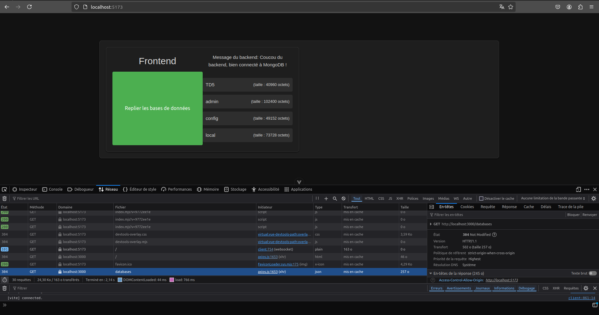

# TD Virtualisation Avancee

## TD 6 : Optimisation et Sécurité

Afin de recontextualiser, nous avons fait le TD précédent en difficulté ``difficile``.  
L'architecture du projet était donc telle que :  
```tree
difficile
├── backend/
│   ├── **Dockerfile**
│   ├── index.js
│   ├── node_modules/
│   ├── package.json
│   └── package-lock.json
|
├── frontend/
│   └── front-td5
│       ├── **Dockerfile**
│       ├── index.html
│       ├── jsconfig.json
│       ├── node_modules
│       ├── src
│       │   ├── api.js
│       │   ├── App.vue
│       │   ├── assets/
│       │   ├── components/
│       │   └── main.js
│       └── vite.config.js
├── mongo-data/
├── docker-compose.yml
```

> On peut remarquer qu'on avait déjà utilisé un **Dockerfile** pour le **backend** ainsi que pour le **frontend**. C'était dans le but de pouvoir installer les dépendances nécessaires en créant notre propre image.

Pour ce TD, nous allons partir d'images minimales afin de créer les nôtres via les **Dockerfile**. 

### Backend & Frontend
Pour le **backend** comme pour le **frontend** on utilisait l'image ``Node.js`` de base. Par souci d'optimisation, on peut la changer pour ``node:18-slim``. On préfère utiliser la version ``slim`` à la version ``alpine``.  
Ce choix dépend du fait que certes, ``alpine`` est quelque plus légère que ``slim`` mais peut poser des problèmes suite à des bibliothèques ou outils système manquants. La version ``slim`` est donc un bon compromis. 
```dockerfile
# On se base sur l'image officielle de node, en version slim
FROM node:18-slim

# On mettra notre application dans /app
WORKDIR /app

# On importe les fichiers de dépendances
COPY package*.json ./
RUN npm install

# Copie le reste du code source
COPY . .

# Puis on démarre le serveur
CMD ["node", "index.js"]
```

Pour rappel, on inclut l'image qu'on a configuré ci-dessus dans notre [docker-compose.yml](difficile/docker-compose.yml) via cette déclaration :  
```yml
backend:  # Définition du service backend
    build:  # Pour construire l'image à partir du Dockerfile qui contient les installations des packages et le lancement du point d'entrée du serveur.
      context: ./backend  # Dossier contenant le Dockerfile.
```

C'est évidemment la même chose pour le **frontend**, il est donc inutile de détailler.

### MongoDB
Pour ce service de base de données, il est inutile de créer un **Dockerfile** puisqu'aucunes configurations/installations supplémentaires ne sont nécessaires pour ce service.

Une [version alpine](https://hub.docker.com/r/mvertes/alpine-mongo) a été développée pour MongoDB v4.0, mais n'est plus maintenue aujourd'hui, entraînant donc des risques de sécurité. Il n'existe pas vraiment de version `slim` ou ``alpine`` officielle pour des raisons techniques.  
MongoDB repose sur certaines bibliothèques système comme ``glibc`` qui ne sont pas disponibles dans Alpine
```yml
database:  # Définition du service MongoDB
    image: mongo:latest  # on utilise donc l'image mongodb
    ports:
      - "27017:27017"  # On fait le mapping entre note hôte et le conteneur pour pouvoir accéder au service
    volumes:
      - ./mongo-data:/data/db  # Pour garder les mêmes données peu importe les instances de cette image
    environment:  # et on définit nos logins pour se connecter à la bdd
      - MONGO_INITDB_ROOT_USERNAME=admin
      - MONGO_INITDB_ROOT_PASSWORD=secret
```

Cependant, on peut trouver une alternative en utilisant une version plus optimisée et légère que la version officielle de l'image MongoDB. Elle n'est pas recommandée pour la production, mais en environnement de tests et développement, on peut utiliser [Bitnami](https://hub.docker.com/r/bitnami/mongodb)


En utilisant à nouveau
```bash
➜  difficile git:(TD6) ✗ docker compose up -d --build
```
Nos conteneurs instancient bien nos nouvelles images, et l'application web est toujours opérationnelle ! 



### Sécurité
Maintenant que nous avons modifié les deux images de base de notre **frontend** et **backend** et conservé celle de notre **database**, nous pouvons tester l'aspect sécurité.

On utilisera l'outil [Trivy](https://github.com/aquasecurity/trivy?tab=readme-ov-file) sur chacune de nos trois images.

On liste déjà nos images pour retrouver celle du backend ainsi que celle du front end. N'ayant pas d'image personnalisée pour **database**, on effectuera le scan sur **mongo:latest**.
```bash
➜  difficile git:(TD6) ✗ docker images
REPOSITORY           TAG       IMAGE ID       CREATED          SIZE
difficile-frontend   latest    42d06515a275   16 seconds ago   327MB
difficile-backend    latest    d1f3191e7d6e   22 seconds ago   221MB
```

Maintenant, pour scanner une image, on peut utiliser directement son ID.

#### difficile-backend
```bash
➜  difficile git:(TD6) ✗ trivy image d1f3191e7d6e
2025-01-04T17:25:57+01:00	INFO	[vuln] Vulnerability scanning is enabled
2025-01-04T17:25:57+01:00	INFO	[secret] Secret scanning is enabled
2025-01-04T17:25:57+01:00	INFO	[secret] If your scanning is slow, please try '--scanners vuln' to disable secret scanning
2025-01-04T17:25:57+01:00	INFO	[secret] Please see also https://aquasecurity.github.io/trivy/v0.58/docs/scanner/secret#recommendation for faster secret detection
2025-01-04T17:26:00+01:00	INFO	Detected OS	family="debian" version="12.8"
2025-01-04T17:26:00+01:00	INFO	[debian] Detecting vulnerabilities...	os_version="12" pkg_num=88
2025-01-04T17:26:00+01:00	INFO	Number of language-specific files	num=1
2025-01-04T17:26:00+01:00	INFO	[node-pkg] Detecting vulnerabilities...
2025-01-04T17:26:00+01:00	WARN	Using severities from other vendors for some vulnerabilities. Read https://aquasecurity.github.io/trivy/v0.58/docs/scanner/vulnerability#severity-selection for details.

d1f3191e7d6e (debian 12.8)

Total: 73 (UNKNOWN: 0, LOW: 57, MEDIUM: 14, HIGH: 1, CRITICAL: 1)
```

#### difficile-frontend
```bash
➜  difficile git:(TD6) ✗ trivy image 42d06515a275
2025-01-04T17:28:45+01:00	INFO	[vuln] Vulnerability scanning is enabled
2025-01-04T17:28:45+01:00	INFO	[secret] Secret scanning is enabled
2025-01-04T17:28:45+01:00	INFO	[secret] If your scanning is slow, please try '--scanners vuln' to disable secret scanning
2025-01-04T17:28:45+01:00	INFO	[secret] Please see also https://aquasecurity.github.io/trivy/v0.58/docs/scanner/secret#recommendation for faster secret detection
2025-01-04T17:28:49+01:00	INFO	Detected OS	family="debian" version="12.8"
2025-01-04T17:28:49+01:00	INFO	[debian] Detecting vulnerabilities...	os_version="12" pkg_num=88
2025-01-04T17:28:49+01:00	INFO	Number of language-specific files	num=2
2025-01-04T17:28:49+01:00	INFO	[gobinary] Detecting vulnerabilities...
2025-01-04T17:28:49+01:00	INFO	[node-pkg] Detecting vulnerabilities...
2025-01-04T17:28:49+01:00	WARN	Using severities from other vendors for some vulnerabilities. Read https://aquasecurity.github.io/trivy/v0.58/docs/scanner/vulnerability#severity-selection for details.

42d06515a275 (debian 12.8)

Total: 73 (UNKNOWN: 0, LOW: 57, MEDIUM: 14, HIGH: 1, CRITICAL: 1)
```


#### mongo:latest
```bash
➜  difficile git:(TD6) ✗ trivy image mongo:latest
2025-01-04T17:29:52+01:00	INFO	[vuln] Vulnerability scanning is enabled
2025-01-04T17:29:52+01:00	INFO	[secret] Secret scanning is enabled
2025-01-04T17:29:52+01:00	INFO	[secret] If your scanning is slow, please try '--scanners vuln' to disable secret scanning
2025-01-04T17:29:52+01:00	INFO	[secret] Please see also https://aquasecurity.github.io/trivy/v0.58/docs/scanner/secret#recommendation for faster secret detection
2025-01-04T17:30:01+01:00	INFO	Detected OS	family="ubuntu" version="24.04"
2025-01-04T17:30:01+01:00	INFO	[ubuntu] Detecting vulnerabilities...	os_version="24.04" pkg_num=127
2025-01-04T17:30:01+01:00	INFO	Number of language-specific files	num=2
2025-01-04T17:30:01+01:00	INFO	[gobinary] Detecting vulnerabilities...
2025-01-04T17:30:01+01:00	INFO	[node-pkg] Detecting vulnerabilities...
2025-01-04T17:30:01+01:00	WARN	Using severities from other vendors for some vulnerabilities. Read https://aquasecurity.github.io/trivy/v0.58/docs/scanner/vulnerability#severity-selection for details.

mongo:latest (ubuntu 24.04)

Total: 31 (UNKNOWN: 0, LOW: 18, MEDIUM: 13, HIGH: 0, CRITICAL: 0)
```