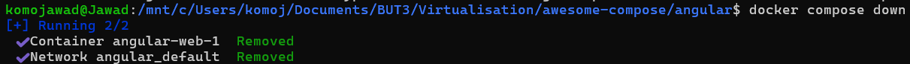

# TD_Virtualisation_Avancee

## TD 1

### Installation de docker
```
sudo apt-get update
sudo apt-get install ./docker-desktop-amd64.deb
```


### Exemple d'utilisation
Pour l'exemple, nous avons choisi le service Angular.
Le projet a la structure suivante :
```
.
├── angular
│   ├── Dockerfile
│   ├── ...
│   ├── ...
│   ....
└── compose.yaml
```

Le compose.yaml se décrit comme suit :
```
services:
  web:
    build: angular
    ports:
    - 4200:4200
    ...
```
Ce fichier défini une application avec un service angular. L'image pour le service est construite grâce au Dockerfile qui se trouve dans le dossier ``angular``.
La section ``ports`` sert à établir une correspondance entre le port du conteneur (ici 4200) et le port de la machine hôte (également 4200). Bien sûr, si le port est déjà utilisé, il faut modifier la valeur.

Et maintenant, on utilise ``docker compose up -d`` pour créer et démarrer le conteneur spécifiés dans le fichier ``compose.yaml``. Le ``-d`` permet l'exécution en arrière-plan, sans cette option, les logs du conteneur s'afficheront directement dans le terminal.


On peut vérifier que le conteneur est bien en cours d'éxecution avec ``docker ps``.


Maintenant que l'application est lancée, on peut y accéder depuis notre navigateur avec l'URL : ``http://localhost:4200``.


Tout fonctionne ! On peut désormais stopper et supprimer le conteneur avec ``docker compose down``.


